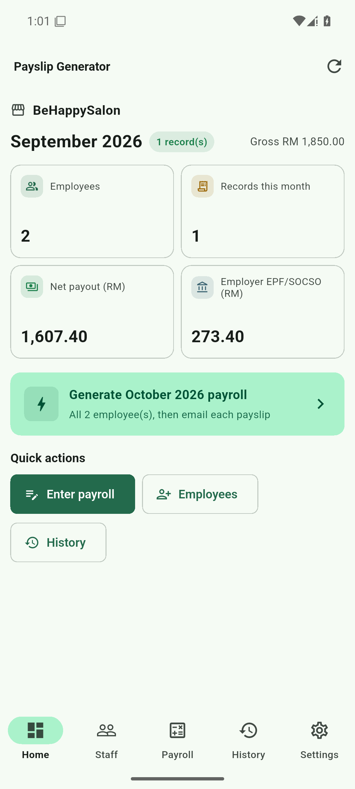

# Payslip Generator

A Malaysian payroll app for small businesses — computes **EPF / SOCSO / EIS**,
generates password-protected payslip PDFs, and emails them to staff.

[简体中文](../README.md) · **English**

---

## Platform status

| Platform | Interface | Status |
|---|---|---|
| Android | Flutter | ✅ Released — 1.0.0 |
| Windows | PySide6 | ✅ Released — reference implementation |

The Android app is a port of the Windows app. Both share the same calculation
engine and produce identical figures.

## Download

| Platform | File | Notes |
|---|---|---|
| Android | `PayslipGenerator-1.0.0.apk` | Android 7.0+ · arm64-v8a / armeabi-v7a / x86_64 |
| Android | `payslip-generator-1.0.0.zip` | APK plus documentation |
| Windows | — | Build from source; see [BUILD.md](BUILD.md) |

Installing on Android: copy the APK to the phone, tap it, and allow *install
from unknown sources* when prompted.

> The APK is signed with a release keystore, not a debug key. Verify with
> `apksigner verify --print-certs` if you want to check before installing.

## Features

| Feature | Description | Android | Windows |
|---|---|---|---|
| Employee records | NRIC, EPF/SOCSO/EIS numbers, bank account, email | ✅ | ✅ |
| Payroll entry | Basic salary, unpaid leave, up to 3 extra items, PCB, advance | ✅ | ✅ |
| EPF / SOCSO / EIS | Statutory tables with `VLOOKUP` approximate-match semantics | ✅ | ✅ |
| Payslip PDF | Single-page A4 matching the original Excel template | ✅ | ✅ |
| PDF encryption | RC4 128-bit · allow print, block copy and modify | ✅ | ✅ |
| Email delivery | SMTP with STARTTLS / SSL / none, one message per recipient | ✅ | ✅ |
| Batch generation | Whole month for every employee in one action | ✅ | — |
| Per-employee result list | Review, resend or share each payslip individually | ✅ | — |
| History | Grouped by month, tap for the full breakdown | ✅ | ✅ |
| Archive employees | Keeps payroll history (statutory retention) | ✅ | ✅ |
| Configurable extra items | Show / hide, and whether they count toward contributions | ✅ | ✅ |

✅ available · — not applicable

## Screenshots

### Home



Month KPIs, and one tap to generate the next month for everyone.

### Payroll


The result updates as you type. Employee deductions carry a minus sign;
employer contributions are dimmed so they are not mistaken for deductions from
pay.

### Payslip PDF


The preview you see is **unencrypted** so you can always check your own work.
The banner states the password the employee will need, and the file you send is
encrypted.

### Batch result


After a batch run you get a per-employee list rather than a file path — an
app-private path is useless on Android, since no file manager can open it.

### History


Tap any record for the full breakdown. Figures are the stored ones and do not
change when you later edit settings.

## Why the numbers are trustworthy

The engine is a **line-by-line port of the reference Excel workbook**, not a
reimplementation.

| Excel column | Meaning | Implemented as |
|---|---|---|
| `H` | TOTAL | `Basic − UnpaidLeave + A + B + C` |
| `AG/AH/AI` | Contribution bases | `Basic − UnpaidLeave` (+ items you tick) |
| `I` / `J` | EPF employee / employer | `VLOOKUP(base, EPF!B15:F415, 5 / 4)` |
| `L` / `M` | SOCSO employee / employer | `VLOOKUP(base, SOCSOEIS!D7:J71, 5 / 4)` |
| `O` / `P` | EIS employee / employer | `VLOOKUP(base, SOCSOEIS!D7:J71, 7 / 6)` |
| `T` | NET | `TOTAL − EPF − SOCSO − EIS − PCB − Advance` |

`VLOOKUP` approximate-match semantics are reproduced exactly: take the **last
row whose lower bound is ≤ the base**.

The port is verified against the original Python engine on **10 reference
vectors** covering unpaid leave, commission, PCB, and salaries above the EPF
ceiling — every figure matches to the cent.

## Repository layout

```
payslip-app/
├── lib/
│   ├── core/
│   │   ├── payroll.dart         Calculation engine (mirrors the Excel formulas)
│   │   ├── rates.dart           EPF / SOCSO / EIS table lookup
│   │   ├── payslip_pdf.dart     PDF generation
│   │   ├── pdf_security.dart    PDF standard security handler (RC4 128-bit)
│   │   ├── database.dart        SQLite schema and data access
│   │   └── mail.dart            SMTP
│   ├── screens/                 One file per screen
│   ├── services.dart            Business rules
│   ├── theme.dart               Design system
│   └── widgets.dart             Shared widgets
├── assets/                      EPF and SOCSO/EIS rate tables
├── docs/
│   ├── USER-GUIDE.md            Walkthrough for the business owner
│   ├── BUILD.md                 Build, sign and verify
│   └── images/screenshots/
└── test/                        32 tests
```

## Testing

```bash
flutter test
```

| Area | What is asserted |
|---|---|
| Engine parity | 10 reference vectors from the original Python engine, matching to the cent |
| PDF | Generation, encryption, and that `Sub-Total` / `Total Deductions` are not clipped |
| Data layer | Settings persistence, archive-not-delete, year ranges |
| Business rules | Email templates, config validation, PDF password derivation |

## Building

See [BUILD.md](BUILD.md).

```bash
flutter pub get
flutter build apk --release
```

The release build **requires** `android/key.properties` and fails without it,
rather than silently falling back to debug signing.

## Documentation

| Document | For |
|---|---|
| [User Guide](USER-GUIDE.md) | The business owner using the app |
| [Build Guide](BUILD.md) | Building and signing from source |

## Disclaimer

- **Not affiliated with EPF, SOCSO or EIS.** The rate tables are transcribed
  from the reference workbook. Verify against the official schedules before
  relying on the output for statutory filings.
- **Data stays on the device.** There is no server and no telemetry. Changing
  phones loses the data unless it is exported first.
- **PDFs are ASCII-only.** The built-in Helvetica / Times fonts are Type1 +
  WinAnsi, so non-ASCII characters (e.g. Chinese) are silently dropped.
  Supporting CJK would mean embedding a TTF, adding roughly 10 MB.
- **v2-only APK signature.** Correct for `minSdk >= 24`.

## Licence

MIT — see [LICENSE](../LICENSE).
