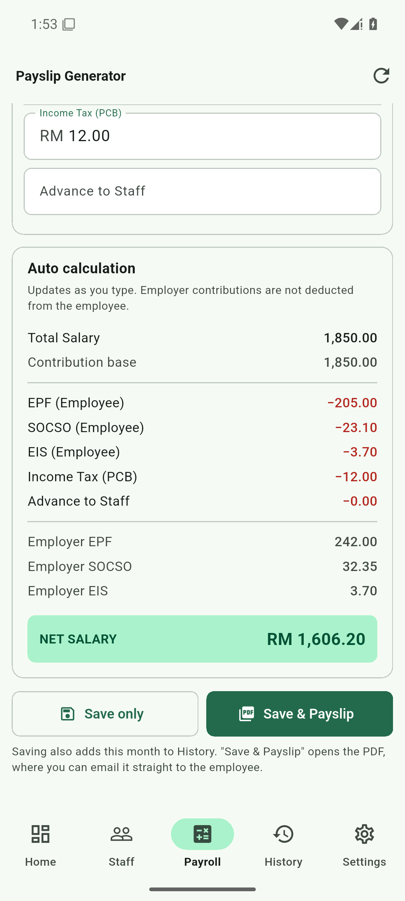
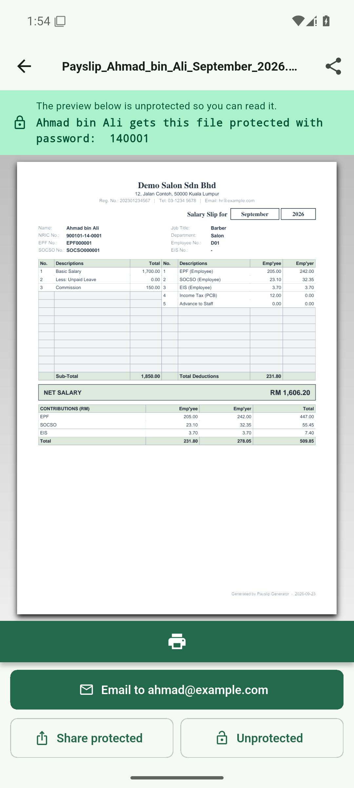
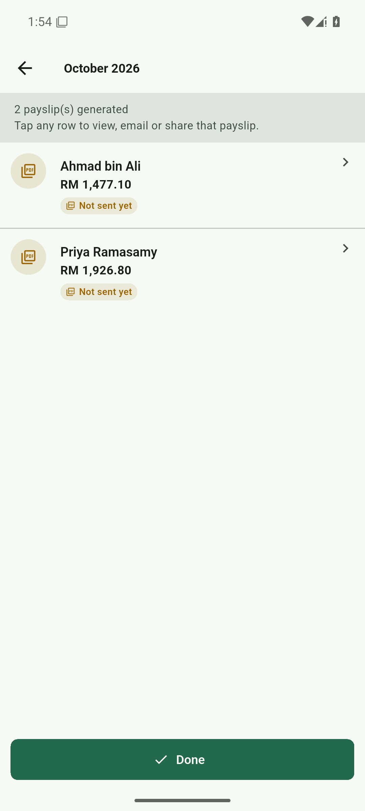
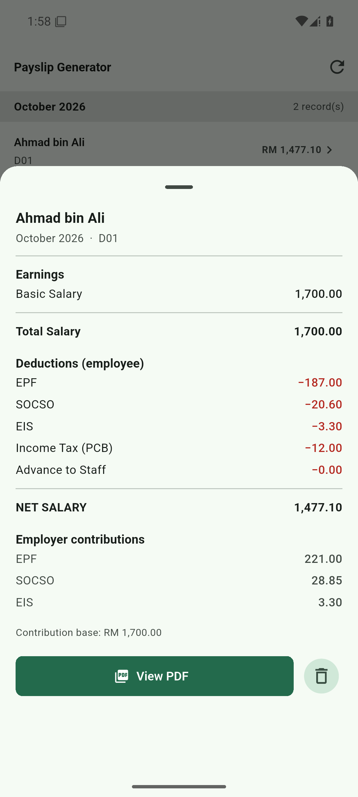

# 使用教程

面向使用这个 App 的老板。不需要懂技术，跟着做一遍就行。

---

## 目录

1. [安装](#1-安装)
2. [第一次设置](#2-第一次设置)
3. [录入员工](#3-录入员工)
4. [给单个员工算工资](#4-给单个员工算工资)
5. [一键生成整月工资并发送](#5-一键生成整月工资并发送)
6. [查看历史记录](#6-查看历史记录)
7. [员工离职怎么办](#7-员工离职怎么办)
8. [常见问题](#8-常见问题)

---

## 1. 安装

1. 把 `PayslipGenerator.apk` 传到手机（微信、数据线、网盘都行）
2. 在手机上点开这个文件
3. 系统会提示「不允许安装未知来源应用」—— 按提示进入设置，
   打开对应开关（通常是「允许来自此来源的应用」），然后返回继续安装
4. 桌面出现 **Payslip Generator** 图标，点开

> 这个 App 不联网也能算工资，只有发邮件时需要网络。

---

## 2. 第一次设置

打开后底部有五个标签：**首页 / 员工 / 算薪 / 历史 / 设置**。

先点 **设置**，里面有四个子页：

### 公司（Company）

填公司名称、地址、注册号、电话、邮箱。
这些会印在每张工资单的抬头，员工一眼就知道是哪家发的。

填完点右下角的 **Save**。底部会提示 `Settings saved.`，
左边状态从 `Unsaved changes` 变成 `All changes saved`。

### 工资项（Payslip）

这里管三个可选的收入项，对应你原来 Excel 里的 A / B / C 三栏。

```
Item name                    Show    EPF/SOCSO/EIS
──────────────────────────────────────────────────
[Item 3               ]       ☐           ☑
[Item 4               ]       ☐           ☑
[Item 5               ]       ☐           ☑
```

- **Item name** —— 改成你的叫法，比如「Commission 佣金」
- **Show** —— 勾上才会出现在算薪页和工资单上。默认全关
- **EPF/SOCSO/EIS** —— 勾上表示这笔钱**也要缴** EPF/SOCSO/EIS。
  不勾的话钱照发，但不扣缴金

> 底薪永远计入缴金基数，无薪假永远减少基数，这两项不用设置。

### 费率（Rates）

一般不用改。只有公积金局调整政策时才需要动。

### 邮件（Email）

| 项目 | 填什么 |
|---|---|
| SMTP server | `smtp.gmail.com`（Gmail）/ `smtp-mail.outlook.com`（Outlook） |
| Port | 587 |
| Encryption | `STARTTLS (587)` |
| Server requires login | 保持打开 |
| Username | 你的完整邮箱地址 |
| Password | **应用专用密码**（见下方说明） |
| From name | 员工看到的发件人名字，比如「79 Ling's Hair Studio」 |
| From address | 你的邮箱地址 |

> **重要：不能用邮箱登录密码。**
> Gmail 和 Outlook 都要求「应用专用密码」。
> Gmail 去「Google 账户 → 安全性 → 两步验证 → 应用专用密码」生成一串 16 位字符。
> 不这么做的话，发送时会报 `Authentication failed`。

填完可以点最下方的 **Save and test connection** 试一下能不能连上。

### 工资单 PDF 密码（Payslip PDF password）

选一种规则：

- **Last 6 digits of IC（推荐）** —— 员工用 IC 后 6 位数字打开
- Last 4 digits of IC
- Full IC number (digits only)
- No password —— 不加密

选完下方会显示示例，比如：

```
🔒 Example — IC 900101-14-0001  →  password 141234
```

**连字符不算**，只取数字。员工 IC 如果没填或太短，那份工资单就不会加密
（批量发送时会提醒你有几份没加密）。

---

## 3. 录入员工

点底部 **员工** → 右下角 **Add**。

必填两项：

- **Employee Name** —— 姓名
- **Basic Salary (RM)** —— 底薪

建议一并填 **Email**，不填的话发不了邮件。列表里会给没填邮箱的员工
标一个黄色的 `no email` 提示。

其他都是选填：IC 号码、员工编号、职位、部门、EPF/SOCSO/EIS 编号、银行账户。

填完点右上角 **SAVE**。

---

## 4. 给单个员工算工资

点底部 **算薪**。

1. 顶部选 **Employee**（员工）、**Month**（月份）、**Year**（年份）
2. 中间填金额：

```
Earnings & Deductions
  Basic Salary *        RM 1700.00
  Less: Unpaid Leave    RM
  Income Tax (PCB)      RM 12.00
  Advance to Staff      RM
```

3. 下方**实时**显示计算结果：

```
Auto calculation
  Total Salary              1,700.00
  Contribution base         1,700.00
  ─────────────────────────────────
  EPF (Employee)             −187.00
  SOCSO (Employee)            −20.60
  EIS (Employee)               −3.30
  Income Tax (PCB)            −12.00
  ─────────────────────────────────
  Employer EPF                221.00
  Employer SOCSO               28.85
  Employer EIS                  3.30
  ─────────────────────────────────
  NET SALARY              RM 1,477.10
```

> 雇主缴纳的部分**不从员工工资里扣**，列出来只是为了让你知道公司要出多少钱。



4. 底部两个按钮：

| 按钮 | 作用 |
|---|---|
| **Save only** | 只存记录，不生成 PDF |
| **Save & Payslip** | 存记录 **并**生成 PDF，跳到预览页 |

### 预览页能做什么

```
Payslip_Ahmad_bin_Ali_October_2026.pdf
🔒 The preview below is unprotected so you can read it.
   Ahmad bin Ali gets this file protected with password: 141234
   ┌────────────────────────────────────┐
   │  Email to ahmad@example.com   │
   └────────────────────────────────────┘
   [ Share protected ]  [ Unprotected ]
```

- 上方说明条告诉你：**你看的是不加密版本**（所以你随时能核对），
  而员工收到的是加密的，密码是多少
- **Email to ...** —— 直接发给这个员工
- **Share protected** —— 分享加密版（微信、WhatsApp、存到网盘都行）
- **Unprotected** —— 分享不加密版（一般用不到）



---

## 5. 一键生成整月工资并发送

回 **首页**，点这张卡片：

```
⚡ Generate October 2026 payroll
   All 2 employee(s), then email each payslip          ›
```

月份是**自动算的下个月**（现在是 9 月就显示 10 月）。

进去后已经帮你预设好：

- Month = October，Year = 2026
- 所有员工都勾选了
- 「Also email each payslip」已打开
- 底部按钮显示 `Generate & Send (2)`

确认无误就点它。会弹一个确认框列出人数，点 **Send** 开始。

> **已发过的人不会重复勾选**，避免重复发工资单给同一个人。
> 如果某个人显示 `Sent 2026-09-23`，说明这个月已经发过了。

### 生成完的列表

跑完会进到一个结果列表：

```
October 2026
2 payslip(s) generated  ·  2 emailed
Tap any row to view, email or share that payslip.
─────────────────────────────────────────────────
📧 Ahmad bin Ali     RM 1,489.10
   Emailed to ahmad@example.com              ›
📧 Priya Ramasamy                 RM 1,926.80
   Emailed to priya@example.com                  ›
─────────────────────────────────────────────────
[ Done ]
```

- 绿色 📧 表示发成功了
- 红色 ⚠ 表示发送失败，下面会写明原因
- **点任意一行** → 进 PDF 预览页，可以单独重发或分享

> 如果某人邮箱填错了发失败，改完员工邮箱后，点进那一行单独重发即可，
> 不用重跑整批。



---

## 6. 查看历史记录

点底部 **历史**。记录按月份分组：

```
October 2026                        2 record(s)
  Ahmad bin Ali  A01   RM 1,489.10  ›
  Priya Ramasamy              A02   RM 1,926.80  ›
September 2026                      1 record(s)
  Ahmad bin Ali  A01   RM 1,607.40  ›
```

**点任意一行**看完整明细：

```
Ahmad bin Ali
September 2026  ·  A01
──────────────────────────────
Earnings
  Basic Salary          1,700.00
  Item A                  150.00
  Total Salary          1,850.00
Deductions (employee)
  EPF                    −205.00
  SOCSO                   −21.90
  EIS                      −3.70
  Income Tax (PCB)        −12.00
  NET SALARY            1,607.40
Employer contributions
  EPF 239.00 · SOCSO 30.70 · EIS 3.70
──────────────────────────────
[ View PDF ]   🗑
```

历史记录用的是**当时存档的数字**，不会因为你后来改了设置而变 ——
已经发给员工的工资单，数字就不该再动了。



---

## 7. 员工离职怎么办

在 **员工** 列表点某人右侧的 **⋮** → **Archive**。

- 员工会移到「已归档」，不再出现在算薪列表里
- **所有工资记录完整保留**（工资记录属于法定留存资料，不能删）
- 随时可以点 **Restore** 恢复

如果确实要彻底删掉（比如录错了），选 **Delete permanently**，
需要手动输入 `DELETE` 确认 —— 这一步会连历史记录一起抹掉，不可恢复。

想查看已归档的员工，点列表上方的 **Show archived**。

---

## 8. 常见问题

**Q：发邮件报 `Authentication failed`**
用了邮箱登录密码。Gmail / Outlook 必须用「应用专用密码」。
去邮箱的安全设置里生成一个。

**Q：发邮件报 `Connection refused`**
SMTP 服务器地址或端口填错了。Gmail 是 `smtp.gmail.com` 端口 `587`，
加密方式选 `STARTTLS (587)`。

**Q：员工说打不开附件**
工资单是加密的。告诉员工用 **IC 后 6 位数字**（不含连字符）。
你可以在预览页上方看到确切密码，直接发给员工。

**Q：员工姓名显示不全 / 缺字**
PDF 字体只支持英文和马来文等拉丁字符。如果姓名含中文会缺字。
需要中文的话要另外嵌入字体，请联系开发。

**Q：月份列表里找不到我要的年份**
年份范围是「今年前后各若干年」，另外会自动包含你已有记录的年份。
如果确实需要更早或更晚的年份，随便建一条那个年份的记录就会出现。

**Q：换了手机数据会丢吗**
会。数据存在手机本地。换手机前请先联系开发导出数据。

**Q：工资单上的 Sub-Total 是什么意思**
左边那列的收入合计。右边是员工扣款合计。净工资 = 合计 − 扣款。
